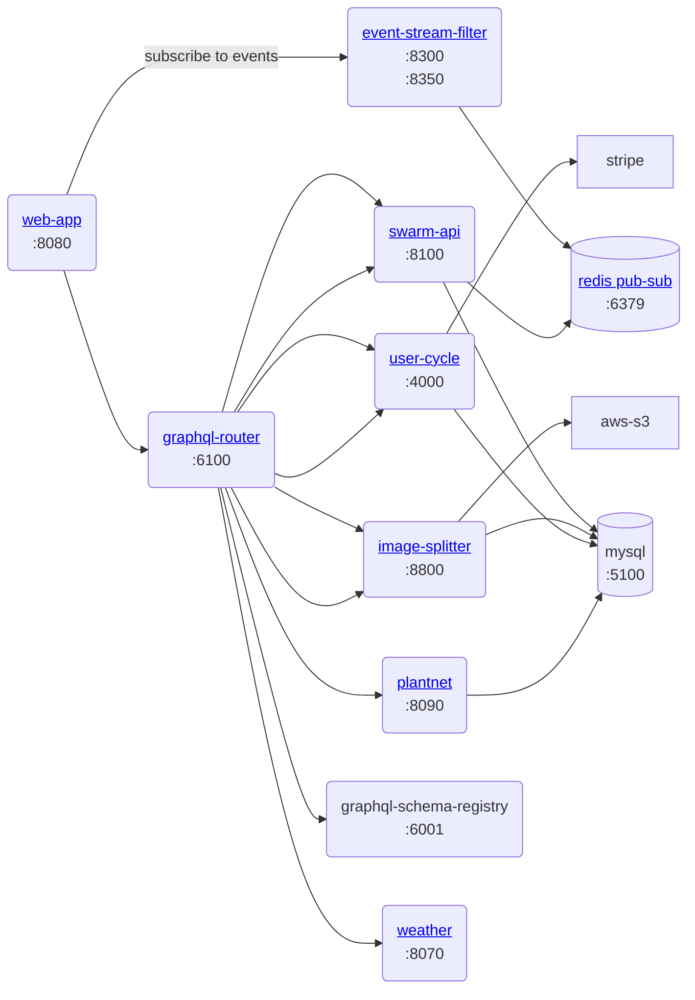

# gratheon/graphql-router

Routes graphql traffic to federated services depending on graphql schema, polled from graphql-schema-registry

## Authentication

### Accessing with API tokens

- Generate API token in https://app.gratheon.com/account
- Pass API token in authorization headers:

```
curl --location 'http://0.0.0.0:6100/graphql' \
--header 'Content-Type: application/json' \
--data '{"query":"{ apiaries { id name } }"}' \
--header 'Authorization: Bearer API_TOKEN_HERE'
```

## Development

```
just start
```

## Architecture



