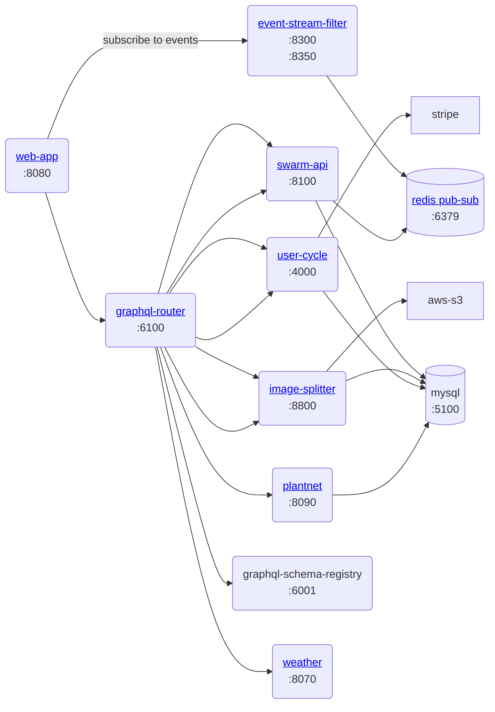

# gratheon/graphql-router
Routes graphql traffic to federated services depending on graphql schema, polled from graphql-schema-registry

## Development

```
just start
```

## Architecture




## License

This project is **dual-licensed**:

- **[AGPL v3](LICENSE-AGPL.md)** - For open source use:
    - ✅ You can use, modify, and distribute the software
    - ✅ Source code is freely available
    - ⚠️ If you modify and host a public instance, you must share your modifications
    - ⚠️ Any derivative work must also be licensed under AGPL v3

- **[Commercial License](LICENSE-COMMERCIAL.md)** - For enterprise customers who need:
    - 🏢 On-premise deployment without source disclosure
    - 🔧 Custom modifications without copyleft obligations
    - 🎨 White-label/rebranding rights
    - 📞 Priority support and SLA guarantees

### Contributing

If you'd like to contribute, please see our [Contributing Guide](CONTRIBUTING.md) and sign our Contributor License Agreement (CLA).
